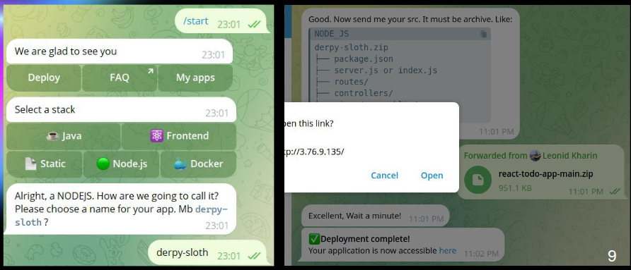
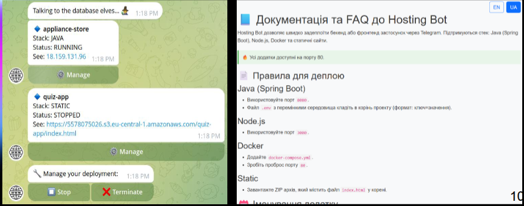

# Temporary Cloud App Hosting via Telegram Bot

## Description

This project provides a system for temporary hosting of applications in the cloud through a Telegram bot. It allows users to deploy, manage, and stop their applications quickly and easily without requiring deep technical knowledge. The bot supports various stacks, including Java (Spring Boot), Node.js, Docker, and static websites.

### Key Features:
- **User-Friendly Interface**: Manage hosting via simple Telegram commands.
- **Prepared Instance Pool**: Ensures fast deployment by maintaining a pool of ready-to-use EC2 instances.
- **Smart Naming**: Generates GitHub-style random names (e.g., `derpy-sloth.zip`) to avoid conflicts and add a friendly touch.
- **Custom Session System**: Tracks user state and current requests efficiently.

## Screenshots

### Bot Interaction Example
                           
*Example of deploying a Node.js app via the Telegram bot.*

### App Management
                       
*Viewing and managing deployed applications.*

## How to Run

### Prerequisites
- **Telegram Bot Token**: Obtain it from [BotFather](https://core.telegram.org/bots#botfather).
- **AWS Account**: Required for EC2, S3, and SSM services.
- **Java JDK 11+**: For running the backend.
- **Maven**: For building the project.

### Installation Steps
1. **Clone the Repository**:

```
git clone github.com:leonid-06/bachelor-project.gitgit
cd hosting-bot
```
   
2. **Configure AWS Credentials**:

Set up your AWS credentials in 
```~/.aws/credentials  ```
or configure environment variables.

3. **Configure Bot Token**:

```
telegram.bot.token=YOUR_BOT_TOKEN
```

4. Build and Run:

```
mvn clean install
java -jar target/app.jar
```